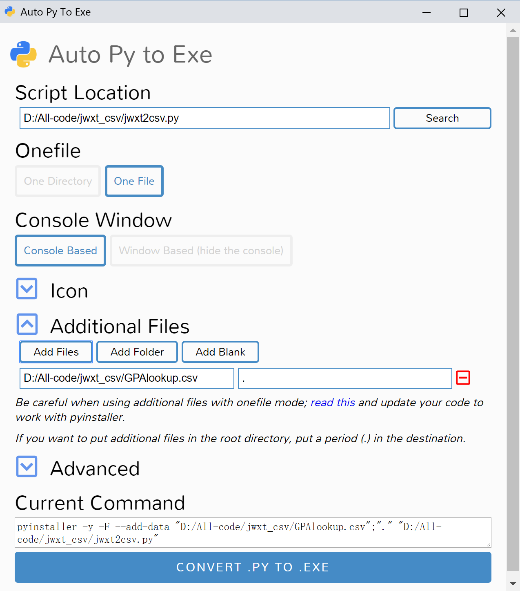

# jwxt_csv

For SUSTech students to export their grade from "jwxt" into csv file. You can open csv file with MS Excel.

[Windows Download](https://github.com/liziwl/jwxt_csv/releases)

Other OS please use python3 to run.

## Dependence

```bash
pip install requests argparse py-getch lxml beautifulsoup4 openpyxl
```

## Usage

### Command

```
usage: jwxt2csv.exe [-h] -u <Username> -p <Password>

jwxt-csv: Grade export tool

optional arguments:
  -h, --help     show this help message and exit
  -u <Username>  CAS Username.
  -p <Password>  CAS password.
```

* example: `jwxt2csv.exe -u 11510123 -p 123456`

### Interactive

Just input as program asked.

## To exe

### CMD

```bash
pip install pyinstaller
pyinstaller -y -F --add-data "D:/All-code/jwxt_csv/GPAlookup.csv";"." "D:/All-code/jwxt_csv/jwxt2csv.py"
```

### GUI

```bash
pip install auto-py-to-exe
```



## Acknowledgment

* @[Boris](https://github.com/BorisChenCZY)
